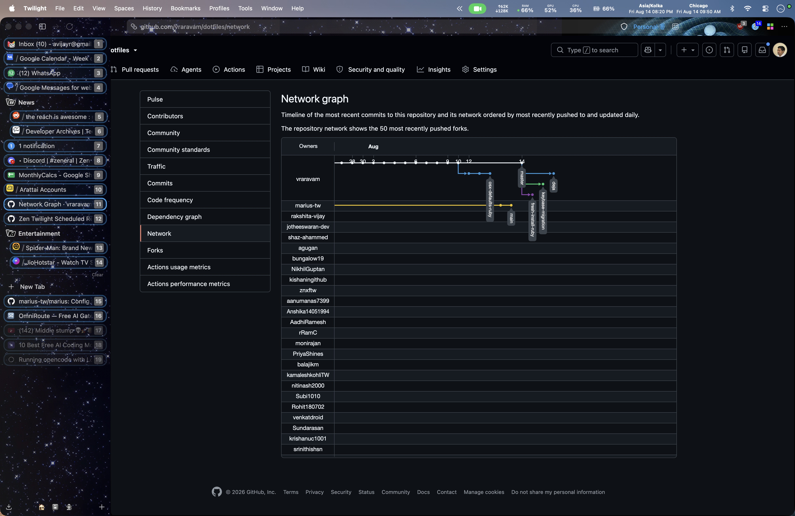

# Animated Neutron Stars With Starfield

Binary neutron stars orbiting with gravitational wave ripples, overlaid on a drifting starfield with 5-layer parallax depth.

**Performance optimized**: Uses pre-rendered GIF/APNG animations instead of CSS keyframes, eliminating continuous CPU/GPU load.



*Animated starfield visible in both navbar (top) and sidebar (left) with neutron stars in the top-right corner*

## Features

- **Binary neutron star animation** - APNG (30 frames) showing orbital motion with gravitational ripples
- **Photorealistic starfield** - 1000+ stars with parallax depth, realistic colors, motion blur, and shimmer
- **5-layer parallax depth** - Multiple depth planes create 3D effect
- **Navigation bar**: Neutron stars (top-right) + horizontal starfield backdrop
- **Sidebar**: Vertical starfield backdrop (Zen Browser + Firefox native vertical tabs)
- **Low resource usage**: Static GIF/APNG playback vs. CSS animations

## Installation

### Zen Browser

1. **Find your Zen Browser profile directory:**
   - Go to `about:support` in Zen Browser
   - Look for "Profile Directory" → click "Open Directory"

2. **Copy this mod folder** into the `zen-themes` directory:
   ```bash
   cp -r animated-neutron-stars-with-starfield <profile-directory>/chrome/zen-themes/
   ```

3. **Restart Zen**

4. **Enable the mod:**
   - Open Zen Browser settings
   - Go to "Zen Mods" section
   - Enable "Animated Neutron Stars With Starfield"
   - Toggle the mod off/on to reload

### Firefox

1. **Enable custom CSS** (do this first while Firefox is open):
   - Go to `about:config`
   - Search for: `toolkit.legacyUserProfileCustomizations.stylesheets`
   - Set to: `true`

2. **Find your Firefox profile directory:**
   - Go to `about:support` in Firefox
   - Look for "Profile Directory" → click "Open Directory"

3. **Create `chrome` folder** (if it doesn't exist):
   ```bash
   mkdir -p <profile-directory>/chrome
   ```

4. **Copy this mod folder** into the `chrome` directory:
   ```bash
   cp -r animated-neutron-stars-with-starfield <profile-directory>/chrome/
   ```

5. **Create or edit** `<profile-directory>/chrome/userChrome.css` and add to the bottom:
   ```css
   /* Animated Neutron Stars With Starfield */
   @import url("animated-neutron-stars-with-starfield/firefox.css");
   @import url("animated-neutron-stars-with-starfield/firefox-vertical-tabs.css");
   @import url("animated-neutron-stars-with-starfield/firefox-sidebar.css");
   ```

6. **Restart Firefox**

**Note**: All three CSS files work together to cover different Firefox sidebar modes (standard bookmarks sidebar, native vertical tabs, and non-expand-on-hover mode).

## Technical Details

### Architecture

**Zen Browser** (`chrome.css`, 13MB):
- Single file with navbar (neutron stars + horizontal starfield) + sidebar (vertical starfield)
- Zen Mods copies CSS content verbatim into `zen-themes.css` without path transformation
- Uses embedded data URIs to avoid external file dependencies

**Firefox** (3 files, total 18MB):
- `firefox.css` (13MB): Navbar (neutron stars + horizontal starfield) + standard sidebar (#sidebar-box)
- `firefox-vertical-tabs.css` (4.7MB): Native vertical tabs (#tabbrowser-arrowscrollbox)
- `firefox-sidebar.css` (5.3KB): Non-expand-on-hover sidebar (CSS gradients)

### Animation Assets (kept for reference in case we want to recreate the embedded data-uri content)

**Neutron Stars APNG**:
- 526×200px, 30 frames
- Embedded as base64 data URI (~5.4MB)
- Extracted from existing chrome.css by build scripts
- Positioned top-right of navigation bar

**Starfield GIFs**:
- Horizontal: 2500×300px (~2.7MB) - navbar background
- Vertical: 400×1500px (~3.6MB) - sidebar background (rotated 90°)
- 150 frames at 15 FPS = 10-second loop
- 1000+ stars per frame with parallax depth
- Star colors: Realistic blackbody spectrum (blue-white hot → orange-red cool)
- Motion blur on fast-moving foreground stars
- Random shimmer effect (opacity variations 0.3-1.0)

### CSS Implementation

**Layering** (z-index):
- Navbar starfield: `z-index: -2` (bottom layer)
- Navbar neutron stars: `z-index: -1` (middle layer)
- Sidebar starfield: `z-index: -1` (behind tabs/content)
- All use `pointer-events: none` (no click interference)

**Background sizing**:
- Navbar: `background-size: cover` (fills width, maintains aspect)
- Sidebar: `background-size: 100% 100%` (stretched to full height)
- Both: `background-repeat: no-repeat`

### Build Scripts

Generate CSS files with embedded data URIs:

```bash
# Zen Browser (navbar + sidebar in one file)
./build-zen-css.sh

# Firefox navbar + standard sidebar
./build-firefox-css.sh

# Firefox native vertical tabs
./build-firefox-vertical-tabs-css.sh
```

All scripts extract neutron stars APNG from the existing `chrome.css` file and embed starfield GIFs as base64.

### Browser Compatibility

- **Zen Browser**: Full support (tested on 1.0.2-b.3+)
- **Firefox**: Full support (requires `toolkit.legacyUserProfileCustomizations.stylesheets = true`)

### File Sizes

- `chrome.css`: 13MB (Zen Browser)
- `firefox.css`: 13MB (Firefox navbar + standard sidebar)
- `firefox-vertical-tabs.css`: 4.7MB (Firefox native vertical tabs)
- `firefox-sidebar.css`: 5.3KB (CSS gradients, no embedded assets)

**Total**: ~18MB for Firefox (all 3 files), ~13MB for Zen Browser

## Credits

Neutron star animation from the ["Animated Neutron Stars" Firefox add-on](https://addons.mozilla.org/en-US/firefox/addon/animated-neutron-stars/).
